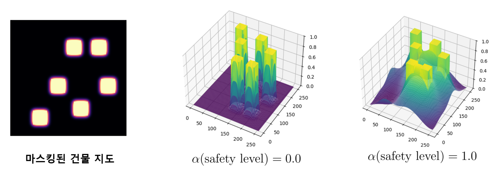
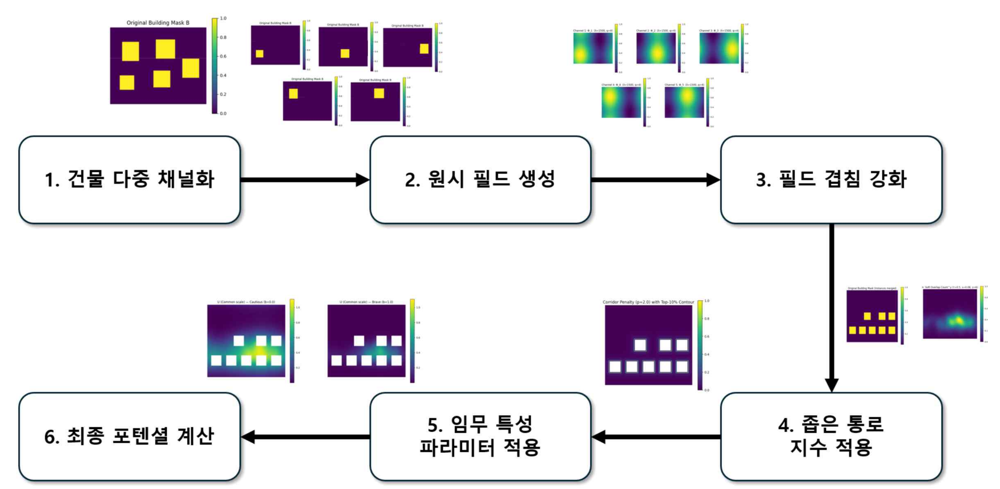
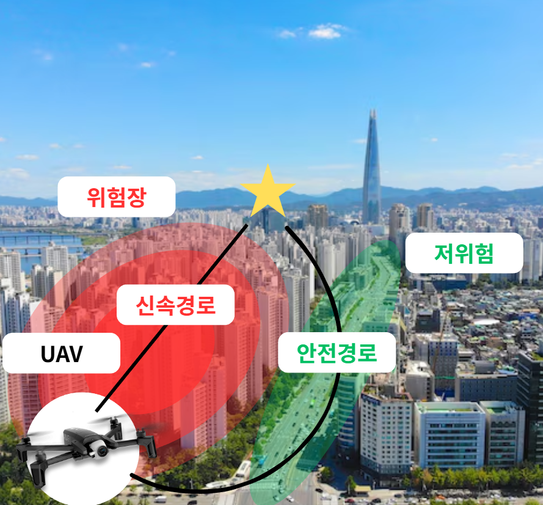

# 겹침·협로를 반영한 위험장과 강화학습을 통한 도시 밀집환경 UAV 안전 항로 학습

---

## 개요

도심 환경에서 UAV의 안전한 항법을 위한 연구 프로젝트입니다.  
건물 밀집도, 협로(corridor), 사용자 성향(조심/과감)을 반영한 **Risk Field 기반 강화학습**을 목표로 합니다.

## Problem Definition

도심 UAV 운용에서는 다음과 같은 문제가 존재합니다:

- 건물 밀집 → 충돌 위험 증가
- 좁은 통로 → 고위험 구간 발생
- 사용자 성향 반영 필요 (조심 vs 과감)

---

### 1. Risk Field Modeling

건물 마스크로부터 연속적인 위험장을 생성합니다.

#### Screened Poisson 기반 필드 생성

$$
\Phi = \mathcal{F}^{-1} \left( \frac{\mathcal{F}(B)}{(1 + \lambda k^2)^q} \right)
$$

---

### 2. Overlap-aware Risk Enhancement

단순 거리 기반이 아니라:

#### (1) 겹침 개수 (Multiplicity)
여러 채널이 동시에 활성화되는 정도를 측정

$$
n_{\text{soft}}(x) = \sum_{i=1}^{N} \sigma\left(\frac{\phi_i(x) - \tau}{\beta}\right)
$$

#### (2) 겹침 강도 (Strength)
몇 개의 건물이 동시에 영향을 주는지 측정

$$
R_{\alpha}(x) = \frac{1}{\alpha} \log \left( \sum_{i=1}^{N} e^{\alpha \phi_i(x)} \right)
$$

#### (3) 겹침 코어 (Core)
단일 위험보다 **진짜 위험한 중심 영역** 추출

$$
P(x) = \sum_{i<j} \phi_i(x)\phi_j(x)
$$

---

### 3. Corridor-aware Risk

협로 위험을 별도로 모델링:

- 최근접 건물 거리 기반
- 협로 지수 적용

좁은 통로일수록 위험 증가

---

### 4. Safety Parameter (User Intent)

사용자 성향을 직접 반영:

- safety = 0 → 공격적 (짧은 경로)
- safety = 1 → 안전 (우회 경로)

**위험장의 형태 자체가 변형됨**

---

##  Reinforcement Learning

### State

- UAV position
- goal direction
- risk field (potential)
- obstacle mask

### Action

- 방향 + 이동 크기 (continuous)

### Reward

- 목표 접근
- 시간 패널티
- 충돌 패널티
- 위험도 감소 보상