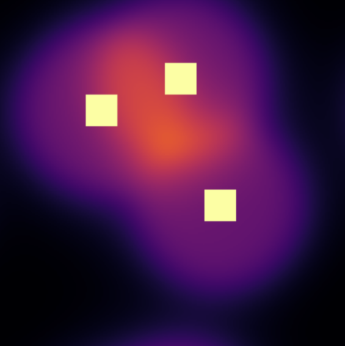
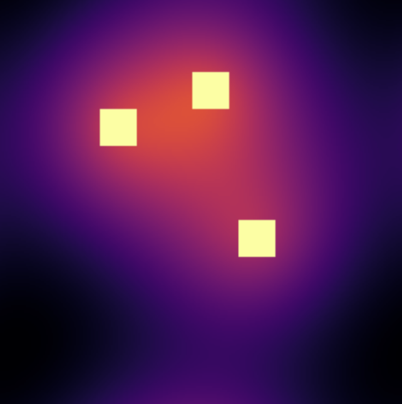

# 겹침·협로를 반영한 위험장과 강화학습을 통한 도시 밀집환경 UAV 안전 항로 학습

---

## 1. 개요

도심 환경에서 UAV의 안전한 항법을 위한 연구 프로젝트입니다.  
건물 밀집도, 협로(corridor), 사용자 성향(조심/과감)을 반영한 **Risk Field 기반 강화학습**을 목표로 합니다.

---

## 2. 문제 정의

도심 UAV 운용에서는 다음과 같은 문제가 존재합니다:

- 건물 밀집 → 충돌 위험 증가
- 좁은 통로 → 고위험 구간 발생
- 사용자 성향 반영 필요 (조심 vs 과감)

---

## 3. 관련 연구

### 3.1. APF(Artificial Potential Field) 

로봇이나 드론의 경로 계획 방법 중 하나로, **목표를 잡아당기는 힘(인력), 장애물은 밀어내는 가상의 힘(척력)** 을 만들어서 이동시키는 방법
최근 다양한 UAV 경로 계획, 장애물 회피 연구에서 활용되고 있음[1][2].

  

#### 3.1.1. APF(Artificial Potential Field) 종류

##### 인력

**Parabolic function**

  

$$
U^{a_p}(Q) = \frac{1}{2}k^a(d(Q))^2
$$

**Conical function**

  

$$
\begin{cases}
U^{a}(Q) = \frac{1}{2} k^{a} d^{2}(Q) \\
f^{a}(Q) = -\nabla U^{a}(Q) = k^{a} (Q_g - Q)
\end{cases}
$$

##### 척력

**FIRAS function**

  

$$
U_i^{r}(Q) =
\begin{cases}
\frac{1}{2} k_i^{r} \left( \frac{1}{d_i(Q)} - \frac{1}{d_i^{0}} \right)^2 & \text{if } d_i(Q) \le d_i^{0} \\
0 & \text{otherwise}
\end{cases}
$$

---

### 3.2 하모닉 필드(Harmonic field)

라플라스 방정식을 만족하는 필드로, 균형 잡힌 장(field)를 만들 수 있음. 기존 연구 로봇 경로 계획에 하모닉 필드를 응용한 연구가 있음[3].

  

$$
\nabla^2 u = 0
$$

---

### 3.3. 심층 강화학습 (Deep reinforcement learning)

강화학습과 딥러닝을 결합한 방법으로 경험을 통해 스스로 최적의 행동을 배우는 **신경망 기반 의사결정 방법**

  

#### 3.3.1. On policy 방식

  

ㅎㅇ

#### 3.3.2. Off policy 방식

  

ㅎㅇ

---

## 4. 제안 방법

건물 마스크로부터 연속적인 위험장을 생성합니다.

#### Screened Poisson 기반 필드 생성

$$
\Phi = \mathcal{F}^{-1} \left( \frac{\mathcal{F}(B)}{(1 + \lambda k^2)^q} \right)
$$

---

### 2. 중첩 위험장 강화

단순 거리 기반 → 위험장이 겹치는 부분은 크게 강화

#### (1) 겹침 개수 (Multiplicity)

여러 채널이 동시에 활성화되는 정도를 측정

$$
M(x) = \sum_{i=1}^{N} \sigma\left(\frac{\phi_i(x) - \tau}{\beta}\right)
$$

#### (2) 겹침 강도 (Strength)

몇 개의 건물이 동시에 영향을 주는지 측정

$$
M(x) = \frac{1}{\alpha} \log \left( \sum_{i=1}^{N} e^{\alpha \phi_i(x)} \right)
$$

#### (3) 겹침 코어 (Core)

단일 위험보다 **진짜 위험한 중심 영역** 추출

$$
C(x) = \sum_{i \lt j} \phi_i(x)\phi_j(x)
$$

---

### 3. Corridor-aware Risk

협로 위험을 별도로 모델링:

- 최근접 건물 거리 기반
- 협로 지수 적용

좁은 통로일수록 위험 증가

---

### 4. Safety Parameter (User Intent)

사용자 성향을 직접 반영:

- safety = 0 → 공격적 (짧은 경로)
- safety = 1 → 안전 (우회 경로)

**위험장의 형태 자체가 변형됨**

---

##  Reinforcement Learning

### State

- UAV position
- goal direction
- risk field (potential)
- obstacle mask

### Action

- 방향 + 이동 크기 (continuous)

### Reward

- 목표 접근
- 시간 패널티
- 충돌 패널티
- 위험도 감소 보상

---

참고 문헌
[1] Z. Pan, C. Zhang, Y. Xia, H. Xiong and X. Shao, "An Improved Artificial Potential Field Method for Path Planning and Formation Control of the Multi-UAV Systems," in IEEE Transactions on Circuits and Systems II: Express Briefs, vol. 69, no. 3, pp. 1129-1133, March 2022, doi: 10.1109/TCSII.2021.3112787.
keywords: {Force;Path planning;Collision avoidance;Planning;Unmanned aerial vehicles;Task analysis;Symmetric matrices;Multi-UAV system;path planning;formation control;artificial potential field},
[2] Z. Pan, C. Zhang, Y. Xia, H. Xiong and X. Shao, "An Improved Artificial Potential Field Method for Path Planning and Formation Control of the Multi-UAV Systems," in IEEE Transactions on Circuits and Systems II: Express Briefs, vol. 69, no. 3, pp. 1129-1133, March 2022, doi: 10.1109/TCSII.2021.3112787.
keywords: {Force;Path planning;Collision avoidance;Planning;Unmanned aerial vehicles;Task analysis;Symmetric matrices;Multi-UAV system;path planning;formation control;artificial potential field},
[3] Connolly, Christopher I., and Roderic A. Grupen. "The applications of harmonic functions to robotics." Journal of robotic Systems 10.7 (1993): 931-946.